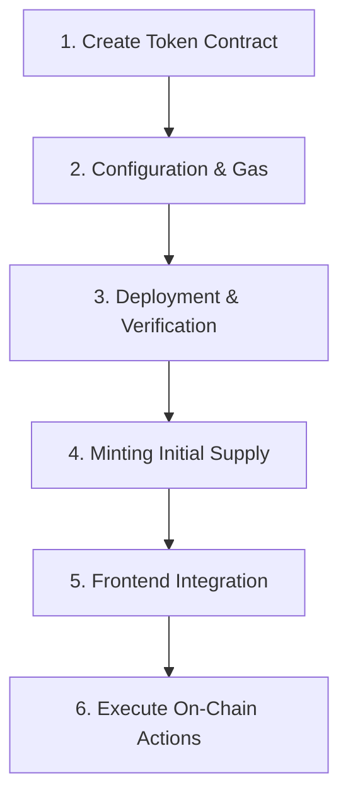

# Crypto Launch Framework

A standardized technical protocol for developing, deploying, and integrating blockchain tokens.

## 📈 Technical Workflow



---

## �️ Setup & Prerequisites

Before starting, ensure your local environment is configured:

1.  **Node.js**: Install Node.js (v18+ recommended).
2.  **Hardhat Project**: 
    - Initialize a new project: `npx hardhat init`
    - Install dependencies: 
      ```bash
      npm install --save-dev hardhat@2.28.0 @nomicfoundation/hardhat-toolbox @openzeppelin/contracts dotenv
      ```
    - Copy this `crypto-launch-framework` folder into your project root.
    - **Pro Tip**: When copying scripts/contracts to your own folders, remember to update import paths (e.g., `import "../MasterToken.sol"`) to match your new structure.
3.  **Authentication**: Setup your `.env` file with `PRIVATE_KEY` and `EXPLORER_API_KEY` for deployment and verification.

---

## �🚀 Step-by-Step Implementation

### Step 1: Create the Token Contract
1.  Create a `contracts/` folder in your project.
2.  Place `MasterToken.sol` (from templates) and your new token contract (e.g., `MyFirstToken.sol`) inside `contracts/`.
3.  Inherit from the template:
- Implement any project-specific logic (hooks) in the contract.
- Ensure the `MINTER_ROLE` is assigned to authorized addresses/contracts.

### Step 2: Network, Gas, and Configuration
Deployment requires a target network and native tokens (e.g., BNB, ETH) for gas fees.

1.  **Fund your Deployer Wallet**: Ensure you have enough gas for deployment and contract verification.
2.  **Configure Environment**: Populate `templates/launch-config.sample.json` with your project data.
3.  **Setup RPC**: Ensure your Hardhat config includes the correct RPC endpoints for the target network.

### Step 3: Deployment & Verification
Execute the deployment script to push your contract to the blockchain.

```bash
npx hardhat run scripts/deploy.ts --network <network_name>
```
The script automatically:
- Deploys the bytecode.
- Verifies source code on the block explorer (Etherscan/BscScan).
- Generates a `deployment-<network>.json` summary.

### Step 4: Minting Tokens
Once the contract is live, you must mint the initial supply or provide minting rights.

- **Helper Script**: Use usage generic script provided in `scripts/mint.ts`:
  ```bash
  npx hardhat run scripts/mint.ts --network <network_name>
  ```
- **Manual Minting**: Use the `mint(to, amount)` function via the block explorer.
- **Automated Minting**: Assign the `MINTER_ROLE` to a backend service or a crowdsale contract.

### Step 5: Frontend Integration
To use the contract in a web application:
1.  **ABI Integration**: Import the generated JSON from the deployment step into your frontend.
2.  **Contract Instance**: Use a library like `ethers.js` or `viem` to create a contract instance using the deployed address.

### Step 6: On-Chain Actions (Send/Receive/Execute)
Trigger actions from the frontend user interface:
- **Send/Receive**: Use `transfer` or `transferFrom`.
- **Approvals**: Use `approve` or `permit` (gasless) for interactions with other contracts.
- **Custom Logic**: Execute any bespoke functions defined in your contract implementation.

---

## � Optional Modules

The framework includes optional smart contracts for advanced use cases. These are **not required** for basic token deployment.

### LendingPool (Reputation-Based Lending)
A configurable lending pool with:
- Multiple tiers with different deadlines (30 days, 90 days, 1 year)
- Automatic interest calculation
- Default detection and liquidation

**Setup Guide**: [docs/LENDING_POOL_GUIDE.md](docs/LENDING_POOL_GUIDE.md)

### Multi-Sig Governance (Gnosis Safe)
Secure multi-signature wallet setup for:
- TokenDistributor admin control
- LendingPool management
- Treasury operations

**Setup Guide**: [docs/MULTISIG_GUIDE.md](docs/MULTISIG_GUIDE.md)

---

## �💎 Tokenomics Distribution (Optional)

For projects requiring vesting schedules (Team, Investors, Community):
1. **Deploy `TokenDistributor.sol`** with your token address and allocation buckets.
2. **Mint total supply** to the Distributor contract address.
3. **Use Multi-Sig Wallets** (e.g., Gnosis Safe) for mainnet beneficiary addresses to enhance security.
4. **Claim tokens** via the `claim()` function after cliff periods expire.


**Setup Guide**: [docs/TOKEN_DISTRIBUTOR_GUIDE.md](docs/TOKEN_DISTRIBUTOR_GUIDE.md)  
**Example**: [docs/TOKENOMICS_DISTRIBUTION_EXAMPLE.md](docs/TOKENOMICS_DISTRIBUTION_EXAMPLE.md)
---

For technical deep-dives, see the [Process Guide](docs/TOKEN_PROCESS.md) and [Security Standard](docs/SECURITY_BEST_PRACTICES.md).
